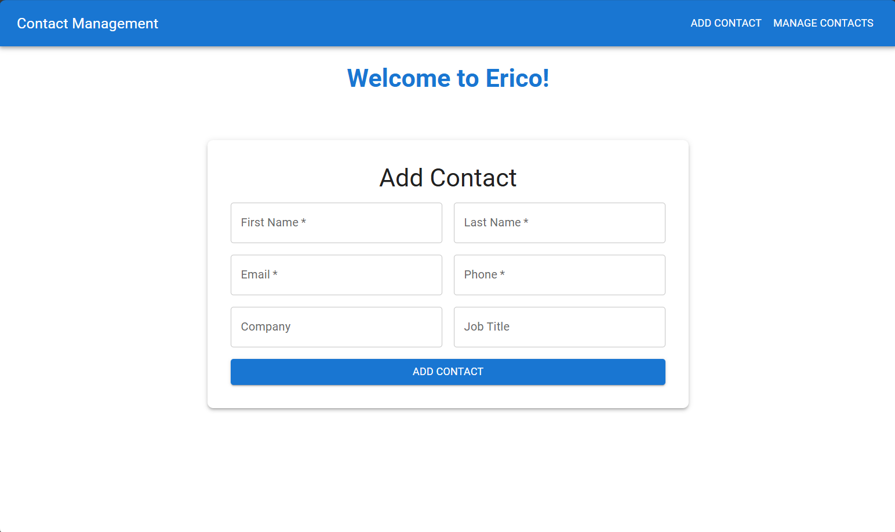
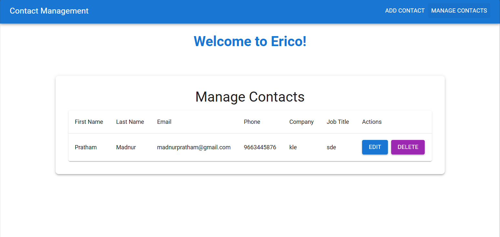

# **Contact Management System**

A fully functional Contact Management System built with **MERN Stack (MongoDB, Express.js, React.js, Node.js)** and styled using **Material-UI**. The application allows users to manage contacts with features to **Add**, **Edit**, **Delete**, and **View** contacts.

---

## **Features**

1. Add new contacts with validations for:
   - Names (letters and spaces only, no numbers or special characters).
   - Email (valid email format).
   - Phone (10 digits only).
2. Edit existing contacts with pre-filled forms.
3. Delete contacts directly from the contact list.
4. View and manage all contacts in a modern, responsive table.
5. Navigation bar with **Add Contact** and **Manage Contacts** pages.
6. Responsive design using **Material-UI**.

---

## **Technologies Used**

- **Frontend**:
  - React.js
  - Material-UI
  - React Router DOM
- **Backend**:
  - Node.js
  - Express.js
  - MongoDB (Mongoose for schema design)

---

## **Folder Structure**

```plaintext
.
├── backend/
│   ├── models/
│   │   └── Contact.js            # Mongoose schema for contacts
│   ├── routes/
│   │   └── contactRoutes.js      # API routes for contact operations
│   ├── controllers/
│   │   └── contactController.js  # Logic for CRUD operations
│   ├── config/
│   │   └── db.js                 # MongoDB connection setup
│   ├── server.js                 # Main server file
├── frontend/
│   ├── public/
│   │   └── index.html            # React entry point
│   ├── src/
│   │   ├── components/
│   │   │   ├── ContactForm.js    # Add/Edit form component
│   │   │   ├── ContactsTable.js  # Contacts table component
│   │   ├── pages/
│   │   │   ├── AddContactPage.js # Add Contact page
│   │   │   └── ManageContactsPage.js  # Manage Contacts page
│   │   ├── App.js                # Main React app
│   │   ├── index.js              # React DOM rendering
│   ├── package.json              # Frontend dependencies
├── README.md                     # Documentation
```

---

## **Setup Instructions**

### **1. Clone the Repository**
```bash
git clone <repository-url>
cd Contact-Management-System
```

### **2. Backend Setup**

1. Navigate to the backend folder:
   ```bash
   cd backend
   ```

2. Install dependencies:
   ```bash
   npm install
   ```

3. Configure the environment:
   - Create a `.env` file in the `backend/` directory.
   - Add the following:
     ```env
     MONGO_URI=<your-mongodb-connection-string>
     PORT=5000
     ```

4. Start the backend server:
   ```bash
   node server.js
   ```

---

### **3. Frontend Setup**

1. Navigate to the frontend folder:
   ```bash
   cd frontend
   ```

2. Install dependencies:
   ```bash
   npm install
   ```

3. Start the frontend development server:
   ```bash
   npm start
   ```

4. Open the application:
   - Navigate to `http://localhost:3000` in your browser.

---

## **API Endpoints**

### **Base URL:** `http://localhost:5000`

| **Method** | **Endpoint**        | **Description**              |
|------------|---------------------|------------------------------|
| `GET`      | `/contacts`         | Fetch all contacts           |
| `POST`     | `/contacts`         | Add a new contact            |
| `PUT`      | `/contacts/:id`     | Update an existing contact   |
| `DELETE`   | `/contacts/:id`     | Delete a contact by ID       |

---

## **Database Schema**

### **Collection Name:** `contacts`

| **Field Name**      | **Type**    | **Required** | **Description**                        |
|---------------------|-------------|--------------|----------------------------------------|
| `_id`               | `ObjectId` | Yes          | Unique identifier for each document    |
| `firstName`         | `String`   | Yes          | Contact's first name                   |
| `lastName`          | `String`   | Yes          | Contact's last name                    |
| `email`             | `String`   | Yes          | Contact's email address (unique)       |
| `phone`             | `String`   | Yes          | Contact's phone number (unique, 10 digits) |
| `company`           | `String`   | No           | Name of the company                    |
| `jobTitle`          | `String`   | No           | Job title of the contact               |
| `createdAt`         | `Date`     | Yes          | Timestamp when the contact was created |
| `updatedAt`         | `Date`     | Yes          | Timestamp when the contact was last updated |

---

## **Screenshots**

### **Home Page**
Displays navigation options:
- **Add Contact**
- **Manage Contacts**


### **Add Contact Page**
Form for adding new contacts with validation:


### **Manage Contacts Page**
Table view with options to edit or delete contacts:


---

## **Challenges Faced and How I Overcame Them**

### **1. Backend Development Challenges**
- **Challenge**: While coding the backend, setting up the routes and ensuring proper communication with the MongoDB database was complex. Debugging the API endpoints to handle CRUD operations efficiently required significant effort.
- **Solution**: 
  - Used Postman to test all endpoints systematically.
  - Added detailed error messages and validations to isolate issues more effectively.
  - Implemented middleware like `express.json` and `cors` to ensure smooth data flow between the frontend and backend.

---

### **2. Axios Integration Errors**
- **Challenge**: A major issue encountered was using **Axios** for API requests in the frontend. Initial API calls failed due to:
  - Incorrect backend URL configurations.
  - Missing or incorrect CORS configuration in the backend.
  - Misaligned data formats between frontend and backend.

- **Solution**:
  - Corrected the backend URL by creating a base Axios instance and centralizing API calls in a `services/api.js` file.
  - Configured the `cors` middleware in the backend server to allow cross-origin requests:
    ```javascript
    const cors = require("cors");
    app.use(cors());
    ```
  - Used `try-catch` blocks in the frontend to handle Axios errors gracefully and debug them effectively:
    ```javascript
    try {
      const response = await axios.get("/contacts");
      setContacts(response.data);
    } catch (error) {
      console.error("Error fetching contacts:", error.message);
    }
    ```

---

### **3. Learning Material-UI (MUI)**
- **Challenge**: Material-UI (MUI) was new to me, and I had to learn it from scratch to style the application professionally. Initially, managing layouts, components, and responsive designs with MUI was challenging.
- **Solution**:
  - Studied Material-UI documentation extensively to understand its components and theming system.
  - Used `Box`, `Grid`, and `Paper` for responsive layouts and `AppBar` for the navigation bar.
  - Customized components using the `sx` prop for inline styling and made the design consistent across all pages.

---

### **4. Debugging API Calls**
- **Challenge**: The data was not being fetched or updated correctly in the frontend due to mismatches between API endpoints and frontend calls.
- **Solution**:
  - Verified API requests and responses using Postman.
  - Updated the backend to return proper error messages with HTTP status codes.
  - Standardized the request and response formats in both frontend and backend.

---

### **5. Handling Form Validations**
- **Challenge**: Ensuring user inputs were valid (e.g., no numbers in names, valid email format, 10-digit phone numbers) was a crucial requirement but initially overlooked.
- **Solution**:
  - Implemented validation logic in both frontend (`ContactForm.js`) and backend (`contactController.js`) using regular expressions and conditional checks.
  - Provided user-friendly error messages in the UI using Material-UI’s `TextField` component.

---

### **6. GitHub Integration**
- **Challenge**: Initially, linking the local repository to GitHub and pushing all the code was difficult due to some initialization issues.
- **Solution**:
  - Resolved the issue by reinitializing the Git repository (`git init`) and linking it to the remote repository.
  - Used the following steps to successfully push all the code:
    ```bash
    git add .
    git commit -m "Initial commit"
    git remote add origin https://github.com/PrathamMadnur01/ContactForm.git
    git push -u origin main
    ```

---

### **What I Learned**
1. **Axios**:
   - How to set up a base Axios instance for API calls.
   - The importance of error handling (`try-catch`) in frontend requests.
   - Debugging cross-origin errors and fixing them with the `cors` middleware.

2. **Material-UI (MUI)**:
   - Building responsive layouts with `Grid`, `Box`, and `Paper`.
   - Customizing components with the `sx` prop for inline styling.
   - Adding navigation with `AppBar` and `Toolbar`.

3. **Backend Development**:
   - Designing a clean and reusable API structure with controllers, routes, and models.
   - Using Mongoose for schema design and data validation.
   - Systematically debugging API endpoints using tools like Postman.

4. **General**:
   - The importance of testing each component/module independently before integration.
   - Proper error handling and validation improve the user experience and reduce debugging time.
