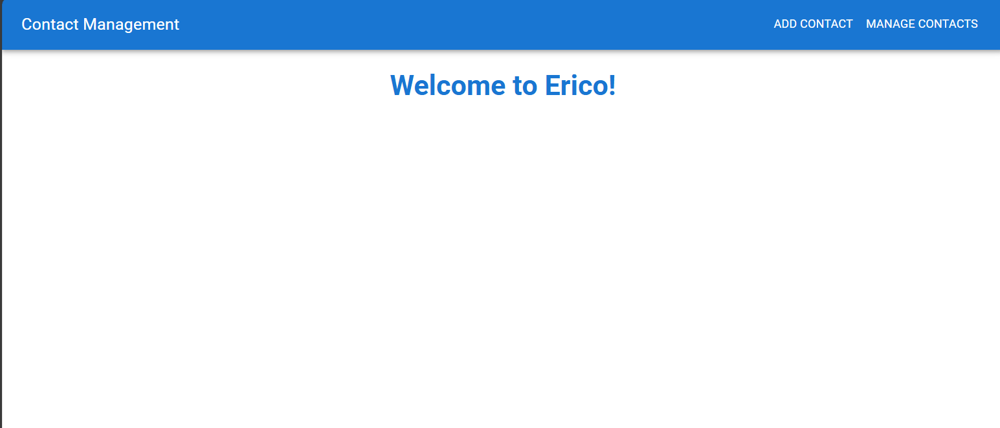

# **Contact Management System**

A fully functional Contact Management System built with **MERN Stack (MongoDB, Express.js, React.js, Node.js)** and styled using **Material-UI**. The application allows users to manage contacts with features to **Add**, **Edit**, **Delete**, and **View** contacts.

---

## **Features**

1. Add new contacts with validations for:
   - Names (letters and spaces only, no numbers or special characters).
   - Email (valid email format).
   - Phone (10 digits only).
2. Edit existing contacts with pre-filled forms.
3. Delete contacts directly from the contact list.
4. View and manage all contacts in a modern, responsive table.
5. Navigation bar with **Add Contact** and **Manage Contacts** pages.
6. Responsive design using **Material-UI**.

---

## **Technologies Used**

- **Frontend**:
  - React.js
  - Material-UI
  - React Router DOM
- **Backend**:
  - Node.js
  - Express.js
  - MongoDB (Mongoose for schema design)

---

## **Folder Structure**

```plaintext
.
├── backend/
│   ├── models/
│   │   └── Contact.js            # Mongoose schema for contacts
│   ├── routes/
│   │   └── contactRoutes.js      # API routes for contact operations
│   ├── controllers/
│   │   └── contactController.js  # Logic for CRUD operations
│   ├── config/
│   │   └── db.js                 # MongoDB connection setup
│   ├── server.js                 # Main server file
├── frontend/
│   ├── public/
│   │   └── index.html            # React entry point
│   ├── src/
│   │   ├── components/
│   │   │   ├── ContactForm.js    # Add/Edit form component
│   │   │   ├── ContactsTable.js  # Contacts table component
│   │   ├── pages/
│   │   │   ├── AddContactPage.js # Add Contact page
│   │   │   └── ManageContactsPage.js  # Manage Contacts page
│   │   ├── App.js                # Main React app
│   │   ├── index.js              # React DOM rendering
│   ├── package.json              # Frontend dependencies
├── README.md                     # Documentation
```

---

## **Setup Instructions**

### **1. Clone the Repository**
```bash
git clone <repository-url>
cd Contact-Management-System
```

### **2. Backend Setup**

1. Navigate to the backend folder:
   ```bash
   cd backend
   ```

2. Install dependencies:
   ```bash
   npm install
   ```

3. Configure the environment:
   - Create a `.env` file in the `backend/` directory.
   - Add the following:
     ```env
     MONGO_URI=<your-mongodb-connection-string>
     PORT=5000
     ```

4. Start the backend server:
   ```bash
   node server.js
   ```

---

### **3. Frontend Setup**

1. Navigate to the frontend folder:
   ```bash
   cd frontend
   ```

2. Install dependencies:
   ```bash
   npm install
   ```

3. Start the frontend development server:
   ```bash
   npm start
   ```

4. Open the application:
   - Navigate to `http://localhost:3000` in your browser.

---

## **API Endpoints**

### **Base URL:** `http://localhost:5000`

| **Method** | **Endpoint**        | **Description**              |
|------------|---------------------|------------------------------|
| `GET`      | `/contacts`         | Fetch all contacts           |
| `POST`     | `/contacts`         | Add a new contact            |
| `PUT`      | `/contacts/:id`     | Update an existing contact   |
| `DELETE`   | `/contacts/:id`     | Delete a contact by ID       |

---

## **Database Schema**

### **Collection Name:** `contacts`

| **Field Name**      | **Type**    | **Required** | **Description**                        |
|---------------------|-------------|--------------|----------------------------------------|
| `_id`               | `ObjectId` | Yes          | Unique identifier for each document    |
| `firstName`         | `String`   | Yes          | Contact's first name                   |
| `lastName`          | `String`   | Yes          | Contact's last name                    |
| `email`             | `String`   | Yes          | Contact's email address (unique)       |
| `phone`             | `String`   | Yes          | Contact's phone number (unique, 10 digits) |
| `company`           | `String`   | No           | Name of the company                    |
| `jobTitle`          | `String`   | No           | Job title of the contact               |
| `createdAt`         | `Date`     | Yes          | Timestamp when the contact was created |
| `updatedAt`         | `Date`     | Yes          | Timestamp when the contact was last updated |

---

## **Screenshots**

### **Home Page**
Displays navigation options:
- **Add Contact**
- **Manage Contacts**



### **Add Contact Page**
Form for adding new contacts with validation:


### **Manage Contacts Page**
Table view with options to edit or delete contacts:


---

## **Known Issues**

1. Ensure the MongoDB server is running before starting the backend.
2. Validation errors may occur if required fields are missing during Add/Edit operations.

---

## **Future Enhancements**

1. Add user authentication for restricted access.
2. Implement advanced search and filtering for contacts.
3. Introduce pagination for managing large datasets.

